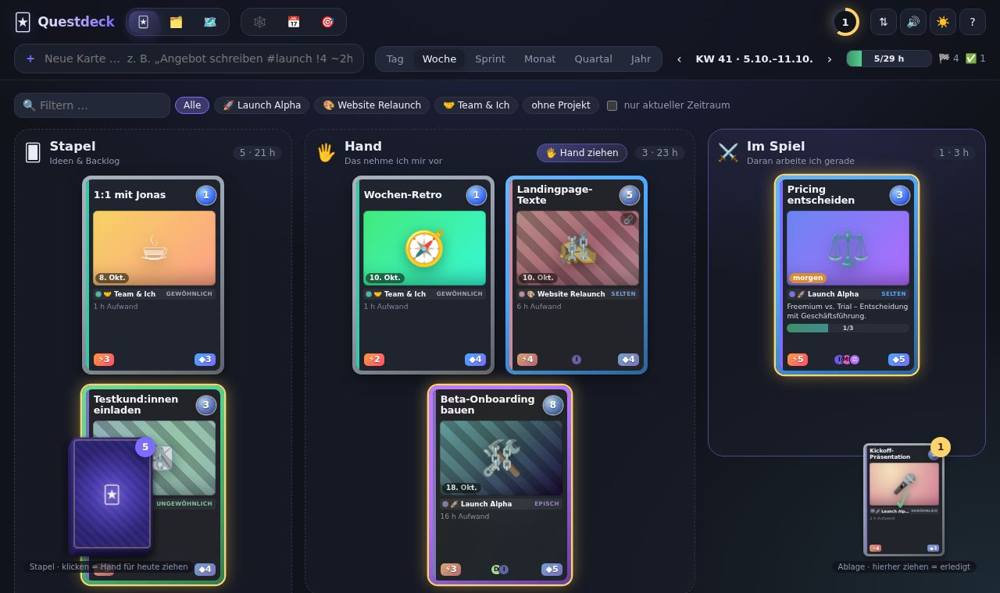
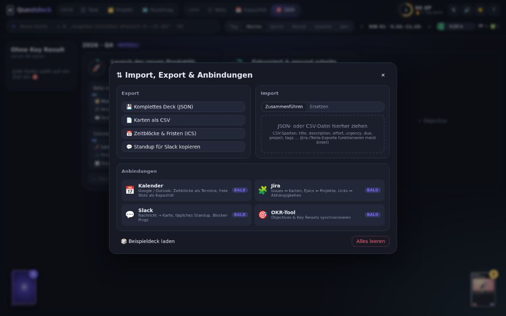
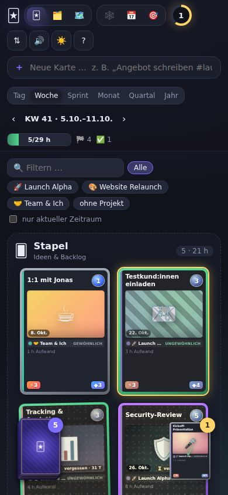

# Design-Review Questdeck

**Stand:** 2026-10-06, Branch `dev/beautiful-hawking-bgir9w` (PR Technotraxx/swarm#1: Ebenen, Folio, Stundenraster)
**Methode:** Screenshots aller Ansichten in Dunkel, Hell und Folio bei 1440, 1280 und 390 px Breite;
Messungen im Browser (Schriftgrößen, Kontraste, Fokus, Zielgrößen); Abgleich mit den
Design-Grundsätzen aus dem `artifact-design`-Skill, insbesondere der Liste typischer KI-Design-Muster.

Die Maßnahmen stehen am Ende als Pakete `DS-NNN` und zusätzlich im [Backlog](BACKLOG.md).

---

## Kurzfassung

Die Grundidee trägt: Karten auf einem Tisch, der Flug auf die Ablage, die Schnell-Eingabe mit
Live-Vorschau und das Stundenraster sind stark. Was die App nach „von einer KI generiert“ aussehen
lässt, sind vor allem fünf Dinge:

1. **Emoji als Bedienelemente.** 174 Emoji-Vorkommen in 65 Varianten im Code, rund 70 sichtbar auf
   dem Tisch. Jeder Tab, jede Spalte, jedes Formularlabel und jede Meldung hat eines.
2. **Lila-Blau-Verläufe.** Logo-Schrift, Primärknöpfe, aktiver Tab, Mana-Kugel, „Im Spiel“-Spalte und
   alle zwölf Kartenmotive sind Verläufe. 48 `gradient`-Regeln im CSS.
3. **Inter überall, alles abgerundet, überall Leuchten.** 97 `border-radius`-Regeln, Karten in
   Rahmen in Spalten-Boxen, Glows auf Logo, Level-Ring, Critical Path, legendären Karten und Fokus.
4. **Farbige Randleiste an jeder Karte** (`.tcg-inner::before`, Kalenderblöcke, Slots). Das steht
   wörtlich auf der Liste der KI-Muster.
5. **Verspielte Texte**, die nichts sagen: „Karte gemischt“, „Zeit für neue Ideen!“, „Leg los! ✨“,
   „Alles verplant 🎉“.

Dazu kommen echte Bedienprobleme: zu kleine Schrift auf Karten (bis 7 px), Stapel, die Karten
verdecken, Aktionen nur bei Hover, Karten per Tastatur nicht bedienbar und eine Kopfleiste, die
170 px Höhe frisst, bevor die erste Karte kommt.

---

## 1. KI-Muster im Detail

### 1.1 Emoji statt Icons
Emoji stehen in Tabs (🃏 🗂️ 🗺️ 🕸️ 📅 🎯), Spaltenköpfen (🂠 🖐️ ⚔️), Formularlabels im Detail
(⏱ 🔗 ⚡ ◆ 🏁 🏷 🗂 🎯 🎨), Abschnittsüberschriften (✅ 📅 🕸 👥 📝), Knöpfen (💾 📄 📅 💬 🎲) und Meldungen
(✨ 🃏 📎 🖐️ 🚫). Probleme:
- Sie sehen auf jedem System anders aus; im Headless-Chrome erschien das Logo als leeres Kästchen.
- Sie konkurrieren mit dem einzigen Ort, an dem Emoji Inhalt sind: dem Motiv der Karte.
- „Emoji als Abschnittsmarker“ ist eines der deutlichsten KI-Signale.

**Empfehlung:** Ein Icon-Set (z. B. Lucide oder Phosphor, 1,5 px Strich, eine Größe) für die
Bedienung. Emoji bleiben ausschließlich Karteninhalt, den der Mensch wählt.

### 1.2 Verläufe und Leuchten
Der lila Akzent `#7c6cff` mit Verlauf nach `#a26bff` sitzt auf Logo, Primärknopf, Tab-Pill und
Kapazitätsbalken. Die zwölf Kartenmotive (`MOTIFS` in `src/lib/game.ts`) sind alle Pastellverläufe. Die
Mana-Kugel ist ein radialer Blauverlauf mit Glanz. Zusammen ergibt das genau den „Lila-Blau-Verlauf“-Look.

**Empfehlung:** Eine Akzentfarbe, flächig, ohne Verlauf. Verläufe und Folie nur dort, wo sie etwas
bedeuten: Folie ausschließlich auf legendären Karten, sonst matte Karten.

### 1.3 Schrift
Inter ist die Standardwahl schlechthin. Auf den Karten wird es zudem auf 7–9 px heruntergerechnet
und mit `-webkit-line-clamp` abgeschnitten.

**Empfehlung:** Eine Schrift mit schmaler Variante für Kartentitel, damit mehr Titel auf die Karte
passt (z. B. IBM Plex Sans Condensed), dazu eine Mono-Schrift für Zahlen (Stunden, Datum, KW).
Kartentitel nicht kleiner als 12 px, Nebentexte nicht kleiner als 11 px.

### 1.4 Rundungen, Rahmen, Schatten
Spalte (gestrichelte, abgerundete Box) → Karte (abgerundet, Rahmen, Schatten) → Bildfeld
(abgerundet, Schatten innen) → Typzeile (abgerundetes Feld) → Werte-Pills (abgerundet). Fünf Ebenen
von „Kästchen“ ohne Hierarchie.

**Empfehlung:** Spalten ohne Box, nur Überschrift und Zählung; der Tisch ist die Fläche. Karten
sind das einzige Objekt mit Rand und Schatten. Innerhalb der Karte keine weiteren Kästchen.

### 1.5 Farbige Randleiste
Jede Karte, jeder Kalenderblock und jeder Slot hat links eine farbige Leiste für das Projekt.

**Empfehlung:** Projektfarbe als **Setsymbol** in der Typzeile (kleines farbiges Zeichen wie ein
TCG-Erweiterungssymbol) und als Kartenrücken auf Stapeln. Im Kalender: Blockfläche leicht getönt,
ohne Leiste.

### 1.6 Texte
- Werbe- oder Spieltexte ohne Information: „Karte gemischt → auf die Hand“, „Der Stapel ist leer – Zeit
  für neue Ideen!“, „Hier ist noch nichts gelandet. Leg los! ✨“, „Alles verplant 🎉“.
- Leere OKR-Ansicht sagt „Jede Karte zahlt auf ein Ziel ein 🎯“, obwohl es keine Karten gibt.
- Viele Mittelpunkte und Gedankenstriche als Trenner: „5 · 21 h“, „6 % · 4 offen · 30 h übrig“.
- Begriffe wechseln: Die Ebene „Initiative“ heißt im Tab „Roadmap“; „Stapel“ ist zugleich die
  Backlog-Spalte und der Ziehstapel, im Kartenspiel-Sprachgebrauch aber auch der Ablagestapel;
  „Linse“ ist für Außenstehende unklar; „Hand ziehen“ und „Karte ziehen“ machen Verschiedenes.

**Empfehlung:** Meldungen sagen, was passiert ist und wo das Ergebnis liegt („3 Karten für heute
geplant, 9:00–15:00“). Ein Glossar mit festen Begriffen (Backlog/Stapel, Hand, In Arbeit, Erledigt;
Task, Projekt, Initiative) und konsequent dabei bleiben. „Linse“ durch „Ansicht“ ersetzen.

---

## 2. Bedienung und Lesbarkeit

### 2.1 Karten sind schwer zu lesen
Gemessen auf dem Tisch (Kartengröße „md“): Seltenheit 7,3 px, Typzeile 8,6 px, Beschreibung 9,1 px.
Auf Projekt-Decks und Stapeln fallen Texte auf 4–5 px. Das Bildfeld belegt rund 40 % der Karte für ein
einziges Emoji, während der Titel nach zwei Zeilen abgeschnitten wird.

Aufwand ist vierfach codiert (Mana-Zahl, Rahmenfarbe über die Seltenheit, Seltenheits-Text,
„1 h Aufwand“), Dringlichkeit und Wichtigkeit stehen als zwei bunte Pills daneben.

**Empfehlung:** Karte neu gewichten: Titel groß (bis 3 Zeilen), Bildfeld auf ein Drittel, Aufwand
einmal als Zahl in Stunden, Dringlichkeit als Punkte (wie in Folio), Seltenheit nur über den
Rahmen. Unten eine **Sammlernummer** (`LA·07/12` = Projektkürzel, Kartennummer, Kartenzahl im
Projekt). Das ist ein Detail, das es nur in diesem Spiel gibt, und zeigt gleichzeitig den
Fortschritt im Projekt.

### 2.2 Zu wenig Karten auf dem Bildschirm
Bei 1440 × 900 passen 6–7 Karten auf den Tisch. Für eine App, die den ganzen Tag offen ist, ist das zu
wenig Überblick.

**Empfehlung:** Dichte-Umschalter „Karten / Kompakt / Liste“. Kompakt = halbe Höhe ohne Bildfeld;
Liste = eine Zeile pro Karte mit denselben Werten.

### 2.3 Stapel verdecken Inhalt
Zieh- und Ablagestapel sind fest unten links und rechts positioniert und liegen über Karten (siehe
Screenshot, „Testkund:innen einladen“ wird verdeckt). Auf dem Handy liegen sie mitten über der Spalte.

**Empfehlung:** Eine feste **Tischkante** unten (60–72 px hoch) mit Ziehstapel links, Ablage
rechts und dazwischen Tagesstand (geplant / Kapazität, erledigt heute, Serie). Der Inhalt endet über
der Kante. Damit wandert auch XP/Level aus der Kopfleiste dorthin.

### 2.4 Kopfleiste zu voll
Zwei Zeilen Kopf plus Filterzeile = rund 170 px. Darin: zwei Tab-Gruppen mit Mini-Überschriften,
Spielerstand, vier Icon-Knöpfe, Eingabe, sechs Zeitraum-Knöpfe, Pfeile, Auslastung, zwei Zähler.
Der Zeitraum wirkt sich auf dem Tisch nur aus, wenn „nur aktueller Zeitraum“ angehakt ist; das
erwartet niemand.

**Empfehlung:**
- Eine Navigationszeile: Tisch · Projekte · Roadmap · Netz · Kalender · Ziele (ohne Überschriften
  „Ebene/Linse“).
- Zeitraum nur in Ansichten zeigen, die ihn nutzen (Kalender, Roadmap, Ablage), auf dem Tisch als
  klarer Filter.
- Spielerstand in die Tischkante (2.3), Einstellungen (Optik, Sound, Import/Export) in ein Menü.

### 2.5 Aktionen nur bei Hover
„Ins Spiel“ und „Erledigt“ erscheinen erst beim Überfahren der Karte. Auf Touch-Geräten und für
neue Nutzer unsichtbar.

**Empfehlung:** Auf der Karte dauerhaft ein dezenter Erledigt-Knopf (Kreis zum Abhaken) in der
Ecke; weitere Aktionen im Detail und per Tastatur.

### 2.6 Tastatur und Barrierefreiheit
- Karten sind per Tab erreichbar (dnd-kit setzt `tabindex`), haben aber **keinen sichtbaren Fokus**,
  Enter öffnet nichts, und ohne `KeyboardSensor` lassen sie sich nicht per Tastatur bewegen.
- Netz-Knoten und Verbindungen sind nur mit der Maus erreichbar.
- Sieben Knöpfe sind kleiner als 24 × 24 px (u. a. Slot-Steuerung, Link-Icon auf der Karte).
- `prefers-reduced-motion` gilt nur für CSS. Die framer-motion-Animationen (Ansichtswechsel, Flug,
  Funken) laufen trotzdem.

**Empfehlung:** Fokus-Token (2 px Ring in Akzentfarbe) für alle bedienbaren Elemente; Enter öffnet,
Leertaste hebt an, Pfeiltasten bewegen zwischen Spalten (dnd-kit `KeyboardSensor`), `E` erledigt die
fokussierte Karte. `MotionConfig reducedMotion="user"` um die App. Mindestgröße 32 px für Knöpfe.

### 2.7 Bewegung
Ansichtswechsel mit Unschärfe und Skalierung (280 ms) bei jedem Tab-Klick; dauerhaft pulsierende
legendäre Karten, laufende Strichlinien im Netz und pulsierende Überfällig-Hinweise (fünf
`infinite`-Animationen).

**Empfehlung:** Ein orchestrierter Moment, der Flug auf die Ablage, bleibt. Ansichtswechsel nur
kurz einblenden (120–150 ms). Dauerschleifen nur bei Auswahl oder Hover. Sound standardmäßig aus
(heute `sound: true` in `DEFAULT_SETTINGS`).

### 2.8 Leere Zustände
Spalten zeigen nur „Leer“, die OKR-Ansicht eine falsche Erfolgsmeldung, die Roadmap einen Satz.

**Empfehlung:** Jeder leere Zustand nennt die nächste Handlung mit Tastenkürzel, z. B. Backlog leer:
„Neue Karte mit N, oder Karten aus Jira/CSV importieren“.

### 2.9 Kartendetail
Ein langer Drawer mit zehn Abschnitten in fester Reihenfolge; selten genutzte Felder (Motiv,
Bild-URL, RACI) stehen vor häufigen (ToDos, Zeitblöcke). RACI sind Komma-Textfelder.

**Empfehlung:** Oben die häufigen Felder (Status, Fällig, Aufwand, Gehört zu, ToDos), darunter
einklappbar „Planung“, „Verbindungen“, „Beteiligte“, „Gestaltung“. Personen als Chips mit
Vorschlägen aus bereits verwendeten Namen.

### 2.10 Import/Export
Gleichgewichtete Knöpfe mit Emoji; „Anbindungen“ sind vier Kacheln, die alle „bald“ sagen und
Platz kosten. „Alles leeren“ steht gleich groß neben „Beispieldeck laden“.

**Empfehlung:** Kurzer Dialog mit zwei Bereichen, Anbindungen als Textzeile mit Verweis auf die
Roadmap, gefährliche Aktion klein und abgesetzt.

### 2.11 Handy
Kopf über vier Zeilen, Stapel über den Karten, Karten in voller Größe (zwei pro Zeile).

**Empfehlung:** Auf dem Handy Kompakt-Dichte als Standard, Navigation unten, Schnell-Eingabe als
schwebender Knopf. Für „immer offen“ bleibt der Desktop die Hauptform; das Handy dient zum
Erfassen und Abhaken.

---

## 3. Was bleiben soll

- **Flug auf die Ablage** mit Rückgängig: der eine Moment, der Freude macht. Ausbauen, nicht vermehren.
- **Schnell-Eingabe** mit Live-Chips und „an Karte anhängen“: das stärkste Bedienelement.
- **Stundenraster** und **Hand ziehen**: klar und nützlich.
- **Netz mit Critical Path**: der eigenständigste Teil der App.
- **Zwei-Klick-Bestätigung** statt Browser-Dialogen.

---

## 4. Gestalterische Richtung

Statt drei gleichrangiger Optiken eine eigene Identität, die aus dem Thema kommt. Zwei Wege:

**A · Sammelkarten, aber echt.** Orientierung an gedruckten Kartenspielen statt an App-Verläufen:
matter Karton, klare Rahmenfarbe je Seltenheit, Setsymbol je Projekt, Sammlernummer, Kartenrücken mit
Muster je Initiative, Folie nur auf legendären Karten. Tisch als ruhige, dunkle Fläche ohne
Farbschleier. Ein Akzent (z. B. Messing) für Auswahl und Fokus.

**B · Karteikasten.** Folio konsequent weiterdenken, aber weg vom generischen „Creme + Serif“-Look,
der selbst auf der Liste der KI-Muster steht: echte Karteikarten (DIN A7, weißer Karton, blaue
Linien, rote Kopflinie), Reiter für Projekte, Stempel „ERLEDIGT“ statt Haken, Büroklammer für Links,
Schreibmaschinen-Zahlen für Stunden und Daten.

Beide Wege nutzen dieselbe Grundlage: ein Icon-Set, eine Schriftfamilie mit schmaler Variante plus
Mono für Zahlen, ein Akzent, Tischkante unten, Dichte-Umschalter. Die Optik-Umschaltung würde dann
nur noch Hell/Dunkel derselben Identität wechseln.

---

## 5. Maßnahmen

| ID | Maßnahme | Größe | Wirkung |
|---|---|---|---|
| DS-001 | Icon-Set statt Emoji in Navigation, Labels, Knöpfen und Meldungen | M | hoch |
| DS-002 | Verläufe und Glows entfernen; ein Akzent, Folie nur für legendäre Karten | S | hoch |
| DS-003 | Schriftwechsel (Sans mit schmaler Variante + Mono für Zahlen); Mindestgrößen 11/12 px | S | hoch |
| DS-004 | Karte neu gewichten: Titel, kleineres Bildfeld, Aufwand einmal, Setsymbol, Sammlernummer | M | hoch |
| DS-005 | Tischkante unten mit Stapeln, Tagesstand und Spielerstand; kein Überdecken mehr | M | hoch |
| DS-006 | Kopfleiste auf eine Navigationszeile; Zeitraum nur, wo er wirkt; Einstellungen ins Menü | M | hoch |
| DS-007 | Tastatur: Fokus-Ring, Enter/Leertaste/Pfeile/E auf Karten, KeyboardSensor, Netz per Tab | M | hoch |
| DS-008 | Dichte-Umschalter Karten / Kompakt / Liste | M | hoch |
| DS-009 | Textdurchgang: Glossar, Meldungen mit Ergebnis, leere Zustände mit nächster Handlung | S | mittel |
| DS-010 | Bewegung: kurze Ansichtswechsel, keine Dauerschleifen, `reducedMotion="user"`, Sound aus | S | mittel |
| DS-011 | Erledigt-Knopf dauerhaft auf der Karte statt nur bei Hover | S | mittel |
| DS-012 | Kartendetail: häufige Felder oben, Rest einklappbar, Personen als Chips | M | mittel |
| DS-013 | Spalten ohne Box, Karten als einziges Objekt mit Rand und Schatten | S | mittel |
| DS-014 | Import/Export-Dialog straffen | S | niedrig |
| DS-015 | Handy: Kompakt als Standard, Navigation unten, schwebende Eingabe | M | niedrig |
| DS-016 | Gestalterische Richtung A oder B festlegen und als Hell/Dunkel umsetzen | L | hoch |

Größen: S = bis 1 Tag, M = 2–3 Tage, L = rund eine Woche (Aufwand, nicht Durchlaufzeit).

**Vorschlag für die Reihenfolge:** DS-002, DS-003, DS-001 und DS-009 zuerst (schnell, nehmen den
generierten Eindruck am stärksten weg), dann DS-005, DS-006, DS-007 (Bedienung), danach
DS-016 als Gesamtrichtung mit DS-004 und DS-008.
