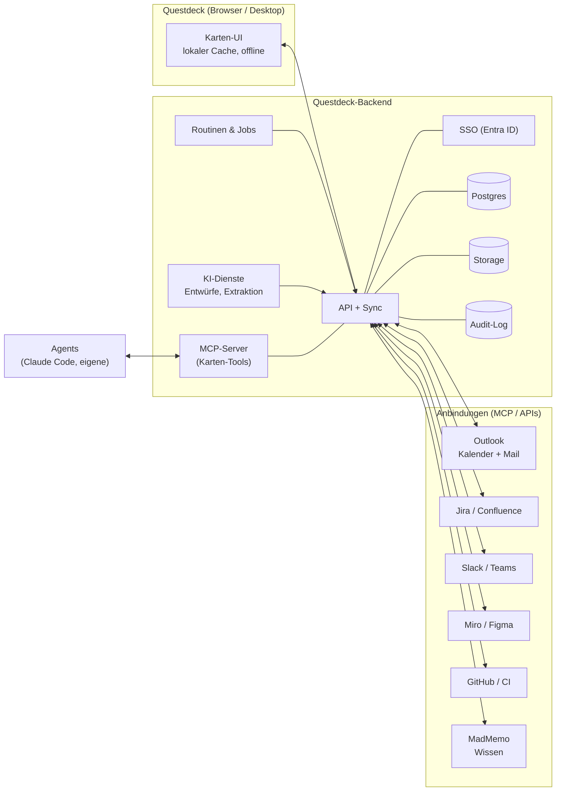

# Questdeck – Vision

> **Questdeck wird die Steuerzentrale für meinen Arbeitstag.** Eine App, die immer offen ist:
> Hier landet alles, was Arbeit erzeugt (Mails, Termine, Meetings, Tickets, Ideen), hier plane ich,
> hier gebe ich Arbeit an Agents ab, und hier sehe ich, was fertig ist.

Stand heute ist Questdeck ein lokales Kartenspiel für die eigene Planung (siehe [README](../README.md)).
Dieses Dokument beschreibt, wohin es wachsen soll. Konkrete Arbeitspakete stehen im [Backlog](BACKLOG.md),
noch offene Entscheidungen in [Offene Fragen](OPEN_QUESTIONS.md).

---

## Leitprinzipien

1. **Alles wird eine Karte.** Eine Mail, ein Meeting-Ergebnis, ein Jira-Ticket, ein Agent-Lauf, ein
   fehlgeschlagener CI-Check – alles erscheint als Karte im Eingang. Die Karte bleibt die eine
   Oberfläche, egal woher die Arbeit kommt.
2. **Die KI schlägt vor, ich entscheide.** KI-Funktionen erzeugen Entwürfe (Karten, Tickets, Updates,
   Zusammenfassungen), die ich mit einem Klick übernehme, ändere oder verwerfe. Nichts geht ungefragt
   nach außen. Das entspricht dem Quarantäne-Prinzip aus MadMemo.
3. **Verbinden statt nachbauen.** Fremde Systeme werden über MCP angebunden, nicht über
   Einzel-Integrationen. Questdeck ist MCP-Client (nutzt Jira, Slack, Miro, Figma, MadMemo …) und
   selbst MCP-Server (Agents und Claude können Karten lesen und schreiben).
4. **Privat by default, teilbar bei Bedarf.** Meine Karten gehören mir. Decks, Projekte und
   Initiativen kann ich gezielt mit dem Team teilen. Das ist dasselbe Prinzip wie bei MadMemo.
5. **Datensouverän.** Hosting, Datenbank und Modellzugriff im eigenen Haus bzw. eigenen Cloud-Account,
   ohne Bindung an einen einzelnen Anbieter.
6. **Ruhig.** Questdeck meldet sich nur, wenn ich handeln muss. Alles andere ist sichtbar, aber still
   (Folio-Optik, gebündelte Rückmeldungen statt Benachrichtigungsflut).

---

## Ausbaustufen

Jede Stufe ist für sich nützlich. Die Reihenfolge ergibt sich aus Abhängigkeiten: Ohne Server und
Login keine Outlook-Anbindung, ohne Anbindungen keine sinnvolle KI-Assistenz.

### Stufe 0 – Heute: das persönliche Kartendeck

Tasks, Projekte und Initiativen als Karten, Abhängigkeitsnetz mit Critical Path, Stundenraster für die
Kapazität, OKRs, „Hand ziehen“, Alterung, Import/Export (JSON, CSV, ICS). Läuft komplett im Browser.

### Stufe 1 – Fundament: Server, Login, Datenbank

Questdeck bekommt ein Backend. Die Browser-Version bleibt schnell und offline-fähig, synchronisiert
aber mit einem Server.

- **SSO-Login** über Microsoft Entra ID (OIDC), damit Outlook-Zugriff und spätere Team-Funktionen auf
  derselben Identität aufbauen
- **Datenbank** (Postgres) für Karten, Links, OKRs und Einstellungen; der lokale Store wird zum Cache
- **Datei-Storage** (S3-kompatibel) für Anhänge, Meeting-Transkripte und Bilder auf Karten
- **Audit-Log** für alles, was Integrationen und Agents tun
- **Secrets-Verwaltung** für Connector-Tokens (Jira, Slack …) pro Nutzer
- Sauberes **Deployment** mit Staging/Produktion, Backups und Monitoring

### Stufe 2 – Angebunden: Outlook und MCP

- **Outlook-Kalender:** Termine verringern automatisch die freie Kapazität im Stundenraster.
  Zeitblöcke von Karten werden auf Wunsch echte Termine („Fokuszeit“). Meetings erscheinen als
  Karten mit Teilnehmenden.
- **Outlook-Mail:** Eine Mail per Klick (oder per Weiterleitung bzw. Kategorie) zur Karte machen,
  mit Link zurück zur Mail. Geflaggte Mails landen im Eingang.
- **MCP-Client:** Verbindungen zu Jira, Slack, Confluence, Miro, Figma, GitHub und MadMemo, verwaltet
  in einer Connector-Übersicht.
- **Questdeck als MCP-Server:** Tools wie `list_cards`, `create_card`, `update_card`, `complete_card`
  und `plan_day`, damit Claude Desktop, Claude Code und eigene Agents direkt mit dem Deck arbeiten.

### Stufe 3 – KI-Assistenz

- **Ticket erstellen:** aus einer Karte ein sauber strukturiertes Jira-Ticket (Story, Bug, Spike …)
  entwerfen, nach Freigabe anlegen, Karte und Ticket bleiben verknüpft
- **Jira-Import und Updates:** Issues als Karten importieren (Epics → Projekte, Initiativen →
  Initiativen), Status in beide Richtungen abgleichen, Kommentare und Worklogs aus Kartennotizen
- **Updates verfassen:** Status-Update für ein Projekt oder eine Initiative aus Kartenverlauf,
  Logbuch und erledigten Karten, als Entwurf für Slack, Mail oder Confluence
- **Meeting → Tasks:** Transkript oder Notizen hochladen (später direkt aus Teams), Zusammenfassung,
  Entscheidungen und Aufgaben extrahieren; Aufgaben werden Karten mit RACI und Fälligkeit
- **Miro/Figma:** Karten mit Boards und Frames verknüpfen; Sticky-Notes oder Kommentare als Karten
  übernehmen; Abhängigkeitsnetz als Board exportieren
- **Tagesbriefing und Wochenrückblick:** Was steht an, was ist blockiert, was ist erledigt, was ist
  neu im Wissen (MadMemo)
- **Planungshilfe:** Aufwand schätzen, große Karten zerlegen, „Hand ziehen“ mit Begründung

### Stufe 4 – Agents, Automatisierung, Routinen

Questdeck wird der Ort, an dem ich Agents steuere und ihre Ergebnisse abnehme.

- **Karte an einen Agent geben:** Eine Karte wird mit Ziel, Kontext und Grenzen an einen Agent
  übergeben (z. B. eine Claude-Code-Session für ein Repo). Die Karte liegt „Im Spiel“ und zeigt
  live, woran der Agent gerade arbeitet.
- **Rückmeldung bei Fertigstellung:** Wenn ein Arbeitspaket erledigt ist (PR offen, Tests grün,
  Dokument geschrieben), kommt die Karte mit Ergebnis zur Abnahme zurück. Nach meiner Freigabe fliegt
  sie auf den Ablagestapel.
- **Routinen:** wiederkehrende Syncs und Checks (Jira-Abgleich, Postfach-Triage, Wochenreport,
  Ticket-Hygiene), zeitgesteuert oder durch Ereignisse ausgelöst, jede Ausführung als kleine Karte
  mit Protokoll
- **Git-Fortschritt:** PRs, CI-Status und Reviews an den zugehörigen Karten; fehlgeschlagene Checks
  erscheinen als Blocker im Netz
- **Freigabe-Warteschlange:** alles, was Agents nach außen tun wollen (Ticket anlegen, Nachricht
  senden, Merge), sammelt sich an einer Stelle zur Bestätigung

### Stufe 5 – Zusammenarbeit

- Mehrere Nutzer, geteilte Decks, Projekte und Initiativen mit Rechten (lesen, bearbeiten, verwalten)
- RACI mit echten Personen aus dem Verzeichnis, Übergaben von Karten mit Kontext
- Kommentare und Erwähnungen auf Karten, Präsenz („wer schaut gerade auf das Netz“)
- Team-Kapazität: wer hat wann Luft, wo staut es sich
- Gemeinsame Roadmap und OKRs über Teams hinweg

---

## MadMemo-Integration

[MadMemo](https://github.com/Technotraxx/daily-work/tree/main/madmemo) ist das agentische
Wissensgedächtnis („E-Mail rein, Wiki raus“): Material wird per Mail eingesammelt, von Claude
klassifiziert und als verlinkter Markdown-Wiki-Artikel abgelegt, nach Karpathys LLM-Wiki-Muster.
Abrufbar ist es per MCP (`search`, `fetch`). Grundsatz: privat by default, teilbar bei Bedarf.

**Questdeck ist das Arbeitsgedächtnis, MadMemo das Wissensgedächtnis.** Beide sollen sich ergänzen,
nicht doppeln:

| Richtung | Was passiert |
|---|---|
| MadMemo → Questdeck | Beim Ingest einer Mail oder eines Dokuments werden Aufgaben, Fristen und Entscheidungen erkannt und als **Kartenvorschläge** in den Questdeck-Eingang gelegt (mit Link auf den Wiki-Artikel). |
| Questdeck → MadMemo | Abgeschlossene Projekte, Logbuch-Einträge, Entscheidungen (Entscheider-Karten) und Meeting-Zusammenfassungen werden als Wissen ins Wiki übernommen, z. B. als Projekt-Dossier oder Retro. |
| Kontext auf der Karte | Eine Karte zeigt passende Wiki-Artikel (MCP-`search` über Titel, Tags, Projekt). KI-Funktionen in Questdeck nutzen MadMemo als Kontextquelle. |
| Gemeinsame Kommandos | Die MadMemo-Kommandos `[neu]`, `[update:slug]` und `[fertig:slug]` gelten auch für Karten: Eine Mail mit `[fertig:karte]` schließt die Karte, `[neu]` legt eine an. |
| Gemeinsamer Eingang | Ein Kanal (Mail, später Slack/Teams), ein Router: Wissen geht ins Wiki, Arbeit wird zur Karte, beides wird verknüpft. |
| Gemeinsame Plattform | Gleiche Identität (Entra-SSO), gleicher Modellzugang, gleiches Audit-Log und Hosting-Muster. Eine Admin-Oberfläche für Projekte, Allowlists und Rechte. |

Die Agent-Runtime aus MadMemo (Claude Code headless, siehe dort ADR-017) ist ein Kandidat für die
Agent-Stufe in Questdeck.

---

## Zielarchitektur (Skizze)

---

## Bewusst nicht (vorerst)

- Kein eigener Mail-Client und kein eigener Kalender: Outlook bleibt das System dafür, Questdeck
  zeigt und verknüpft.
- Kein Ersatz für Jira im Team: Jira bleibt Quelle für Team-Tickets, Questdeck ist meine Sicht darauf.
- Keine Automatik ohne Freigabe für Aktionen nach außen.
- Keine Gamification, die unter Druck setzt: XP und Serien bleiben freundlich und abschaltbar.
